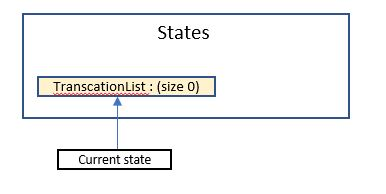
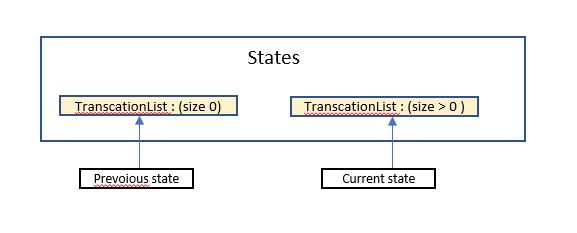
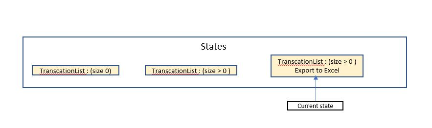

# Developer Guide

## Design & implementation

{Describe the design and implementation of the product. Use UML diagrams and short code snippets where applicable.}

## Design

##### Architecture - Sample (To Be Changed)


##### Component


##### Storage Component
######Storage(Load)


###### Storage(save)


API:  ```Storage.java```

The Storage Component,
* Load function will read the text file and passing the list of string in the file
to the decoding class. 

* Saving function will Encode the transaction detail and pass it back to storage
to save to the file. 


###### Search Command Sequence Diagram


###### Total Command Sequence Diagram


## Product scope
##### Target user profile

* Has a need to manage his/her expenses
* Is able to use command line interface (CLI)
* Can type fast
* Prefers typing to interaction with a graphical user interface (GUI)
* Is comfortable using CLI apps

##### Value proposition: 
To manage all expenses faster than a typical excel budget spreadsheet.


## User Stories

|Priority|Version| As a ... | I want to ... | So that I can ...|
|--------|--------|----------|---------------|------------------|
|***|v1.0|Student|see usage instructions|refer to them when I forget how to use the application|
|***|v1.0|Student|exit the program|close the program|
|***|v1.0|Student|add my daily expenses in the system|add the information into the system and keep track of my daily expenses|
|***|v1.0|Student|view all my transactions by category in the system|be aware of what I have added|
|***|v1.0|Student|remove my daily expense in the system|remove the transactions|
|***|v1.0|Student|search for an expenses with keyword in the system|filter out the expenses that I want to see|
|***|v1.0|Student|see the total expense incurred in the system|be aware of my spending|
|***|v2.0|Student|update my expenses in the system|update the transactions|
|***|v2.0|Student|Save all transactions to a readable text file and load from it|I can have a copy of transaction history.|
|**|v2.0|Student|categorize my daily expense in the system|better managed/view my expenses|
|**|v2.0|Student|add a budget in the system||
|**|v2.0|Student|delete a budget in the system||
|**|v2.0|Student|view the budget with respect to expenses in the system||
|**|v2.0|Student|view the transactions in the system with a specific time period|I can find the specific transaction more easily|
|**|v2.0|Student|generate and export a transactions report summary with a specific time period|keep a copy and view them outside the system|
|**|v3.0|Student|view my expenses given a time period|view how much i spent during that period.|
|*|v2.0|Student|make sure I input daily expenses|I can keep track of it|
|*|v2.0|Student|view tips on saving money|have motivation to achieve my goal|

## Non-Functional Requirements

1. Should work on any mainstream OS as long it has Java ```11``` or above installed.
2. User will be able to interact with the systems with regular english text. For example: (```
add chicken rice $4.00 2020-11-01 /C FOOD. ```).
3. Will be able to handle up to 1000 expenses without noticeable slowness in performance for typical usage.
4. User will be able to interact with their expenses.txt if they wish to make amendment. 

## Glossary

* *MainStream OS* - Windows, Linux, Unix, OS-X

## Instructions for manual testing

{Give instructions on how to do a manual product testing e.g., how to load sample data to be used for testing}

## Implementation
This section describes some noteworthy details on how certain features are implemented.

##### Report Feature

The purpose of report feature is to facilitate user to generate report for the expenses user entered. 
It extends Command and TrancationList, get all the transcations and generate report with a time period.

Given below is an example usage scenario and how the report mechanism behaves at each step.

Step 1. The user launches the application for the first time. The TrancationList is empty, there is no record in the transcationList, user will need to add transaction.



Step 2. User should enter the add command and add in some of the transcations in order to extract the report with valuable data.



Step 3. After user enters record in transactionList, then can proceed to generate the report with or without a time period.



In the stage 3, when transaction export to excel file, program is using external library called 'Apache-POI', this library helps to generate the excel file into such format that:


The following activity diagram summarizes what happens when a user executes a report command:

