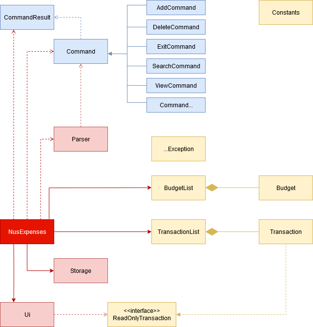

# Developer Guide

## Design & implementation


{Describe the design and implementation of the product. Use UML diagrams and short code snippets where applicable.}

## Design

####


## Product scope
##### Target user profile

* Has a need to manage his/her expenses
* Is able to use command line interface (CLI)
* Can type fast
* Prefers typing to interaction with a graphical user interface (GUI)
* Is comfortable using CLI apps

##### Value proposition: 
To manage all expenses faster than a typical excel budget spreadsheet.


## User Stories

|Priority|Version| As a ... | I want to ... | So that I can ...|
|--------|--------|----------|---------------|------------------|
|***|v1.0|Student|see usage instructions|refer to them when I forget how to use the application|
|***|v1.0|Student|exit the program|close the program|
|***|v1.0|Student|add my daily expenses in the system|add the information into the system and keep track of my daily expenses|
|***|v1.0|Student|view all my transactions by category in the system|be aware of what I have added|
|***|v2.0|Student|update my expenses in the system|update the transactions|
|***|v2.0|Student|Save all transactions to a readable text file and load from it|I can have a copy of transaction history.|
|***|v1.0|Student|remove my daily expense in the system|remove the transactions|
|***|v1.0|Student|search for an expenses with keyword in the system|filter out the expenses that I want to see|
|***|v1.0|Student|see the total expense incurred in the system|be aware of my spending|
|**|v2.0|Student|categorize my daily expense in the system|better managed/view my expenses|
|**|v2.0|Student|add a budget in the system||
|**|v2.0|Student|view the budget in the system||
|**|v2.0|Student|generate and export a transactions report summary with a specific time period|keep a copy and view them outside the system|
|*|v2.0|Student|make sure I input daily expenses|I can keep track of it|
|*|v2.0|Student|view tips on saving money|have motivation to achieve my goal|

## Non-Functional Requirements

1. Should work on any mainstream OS as long it has Java ```11``` or above installed.
2. User will be able to interact with the systems with regular english text. For example: (```
add chicken rice $4.00 2020-11-01 /C FOOD. ```).
3. Will be able to handle up to 1000 expenses without noticeable slowness in performance for typical usage.
4. User will be able to interact with their expenses.txt if they wish to make amendment. 

## Glossary

* *MainStream OS* - Windows, Linux, Unix, OS-X

## Instructions for manual testing

{Give instructions on how to do a manual product testing e.g., how to load sample data to be used for testing}
