# Developer Guide
* [Setting Up and Getting Started](#Setting-Up-and-Getting-Started)
* [Design](#Design)
  * [Architecture](#Architecture)
  * [UI component](#Component)
  * [Storage component](#Storage-Component)
  * [Common classes](#Component)
* [Implementation](#Implementation)
* [Appendix: Requirements](#Appendix:-Requirements)
  * [Product scope](#Product-scope)
  * [User stories](#User-Stories)
  * [User Cases](#Use-Cases)
  * [Non-Functional Requirements](#Non-Functional-Requirements)
  * [Glossary](#Glossary)


## Setting Up and Getting Started
:heavy_exclamation_mark: **Caution** Follow the steps in the following guide precisely. Things will not work out if you deviate in some steps.

First, **fork** this repo, and **clone** the fork into your computer.
If you plan to use Intellij IDEA (highly recommended):

1. **Configure the JDK:**
  * Ensure you have the correct JDK version installed in your computer.
  * Open IntelliJ (if you are not in the welcome screen, click File → Close Project to close the existing project dialog first).
  * Set up the correct JDK version for Gradle.
   * Click Configure → Project Defaults → Project Structure
   * Click New…​ and set it to the directory of the JDK.
2. **Import the project as a Gradle project:**
  * IntelliJ IDEA by default has the Gradle plugin installed. If you have disabled it, go to File → Settings → Plugins to re-enable them.
  * If your project involves GUI programming, similarly ensure the JavaFX plugin has not been disabled.
  * Click Import Project (or Open or Import in newer version of Intellij).
  * Locate the `build.gradle` file (not the root folder as you would do in a normal importing) and select it. Click OK.
  * If asked, choose to Open as Project (not Open as File).
  * Click OK to accept the default settings but do ensure that the selected version of Gradle JVM matches the JDK being used for the project.
  * Wait for the importing process to finish (could take a few minutes).
  * :heavy_exclamation_mark: **Note**: Importing a Gradle project is slightly different from importing a normal Java project.
3. **Verify the setup:**
  * Run the `NusExpenses.java` and try a few commands.
  
## Design

##### Architecture
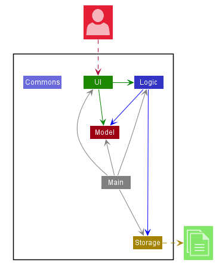

The ***Architecture Diagram*** shown gives an overview of the high-level design.

`Main` has one class named `NusExpenses`. It would perform the following functions:

- At launch: Initialize the components in the correct sequence, and connect them up with each other.
- At shut down / Exit: Shuts down the components and invokes save / cleanup methods where necessary.

`Constants` holds a collection of frequently used static messages used by multiple other components.

The application then consists of four other components:

- `UI`: The UI of NUS Expenses Tracker (NET).
- `Logic`: The command executor. 
- `Model`: Hold the data of NET in memory.
- `Storage`: Read data from, and writes data to the hard disk.

One example would be the `Storage` component which defines its API in `Storage.java` as well as exposes its functionality using the same class.

##### Component


##### Storage Component
###### Storage(Load)
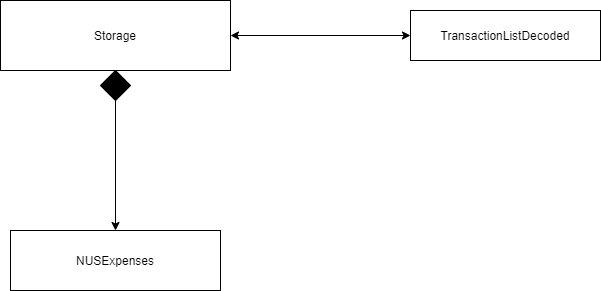

###### Storage(save)


API:  ```Storage.java```

The Storage Component,
* Load function will read the text file and passing the list of string in the file
to the decoding class. 

* Saving function will Encode the transaction detail and pass it back to storage
to save to the file. 

The *Sequence Diagram* below shows how the components interact with each other in the scenario where the user issues the command ```search keyword```

###### Search Command Sequence Diagram
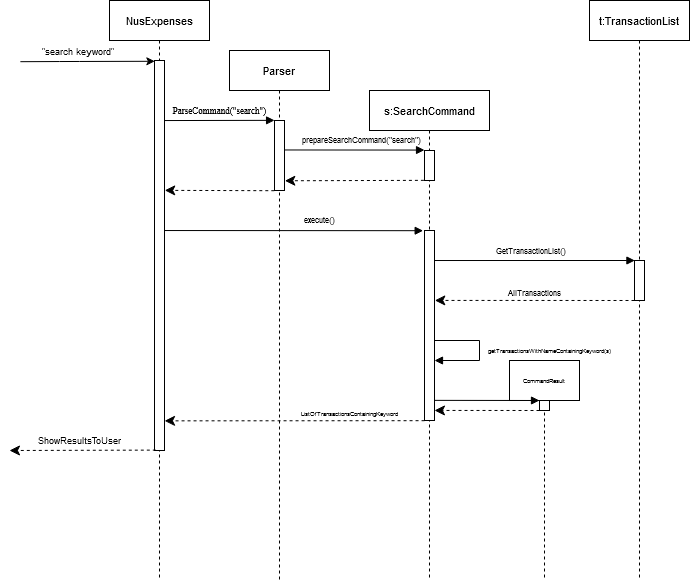

The following *Object Diagram* gives an overview of which objects are accessed and associated with the execution of the `Search` command.

###### Search Command Object Diagram
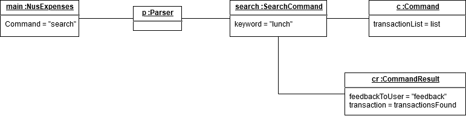

The following *Sequence Diagram* shows how the components interact in the scenario where the user issues the `total` command.

###### Total Command Sequence Diagram
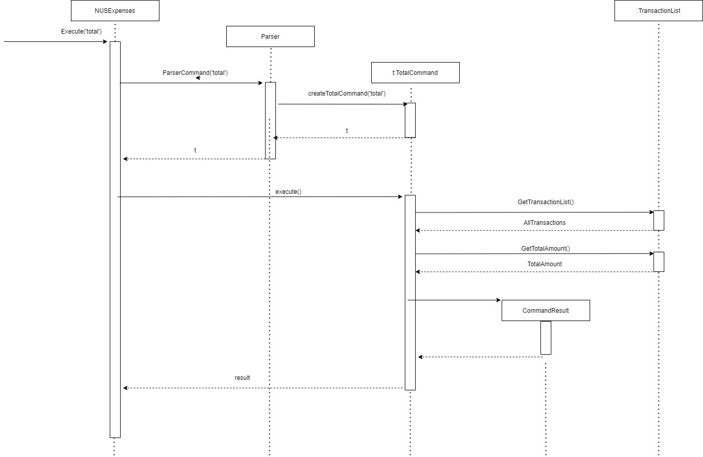

The *Budget View Object Diagram* gives an overview of which objects are accessed and associated when the `budgetview` command is called, together with sample values for illustration 
###### BudgetView Object Diagram
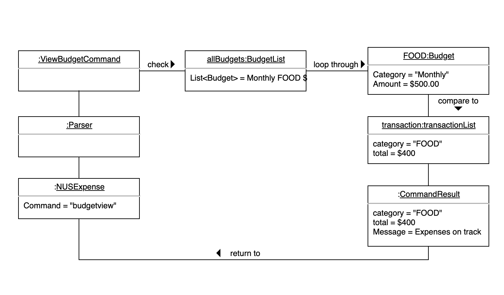

The *Budget View Sequence Diagram* shows how does components interact with each other in the scenario when user issues `budgetview` command.
###### BudgetView Sequence Diagram
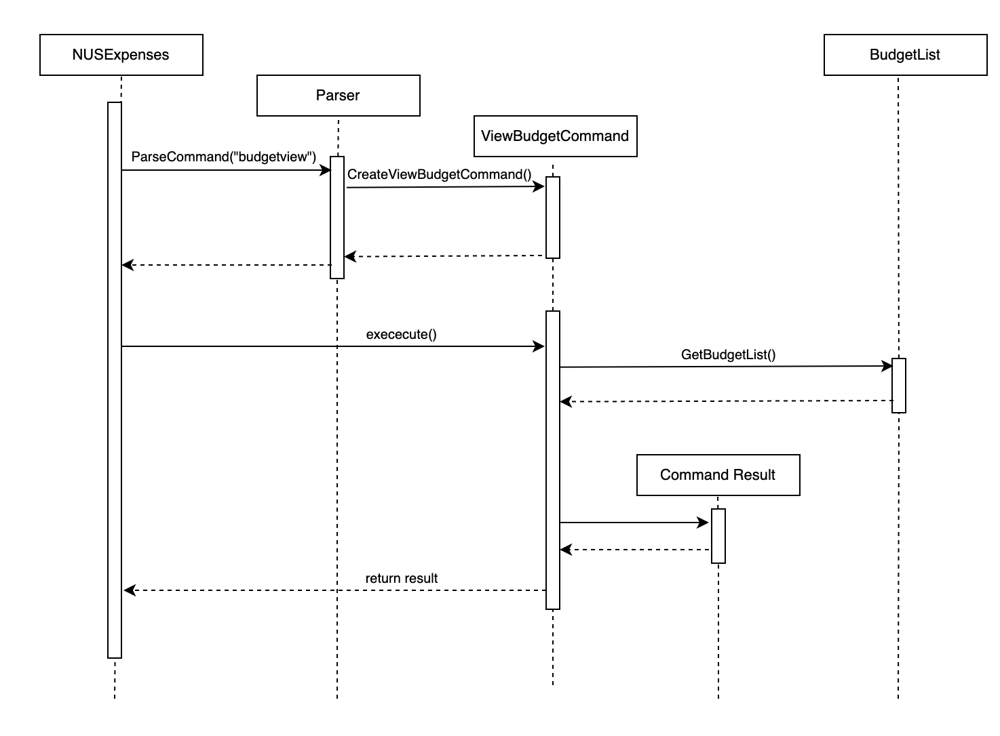

## Implementation
This section describes some noteworthy details on how certain features were implemented.

##### Delete Feature

The purpose of `Delete` function is to facilitate user to remove a transaction in the TransactionList if they made a mistake.
It extends Command and TransactionList to get the correct index to remove.

Given below is an example usage scenario and how the `Report` mechanism behaves at each step.

Step 1. The user launches the application for the first time. The TransactionList is empty.

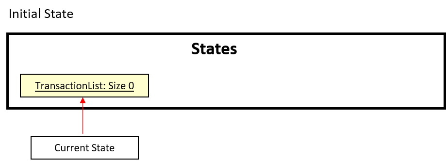

Step 2. User executes ```add Lunch at ...``` to add a new transaction. The ```add``` command will save the record into TransactionList. User will continue to add another 5 more records to the TransactionList. There are a total of 6 Transactions saved.

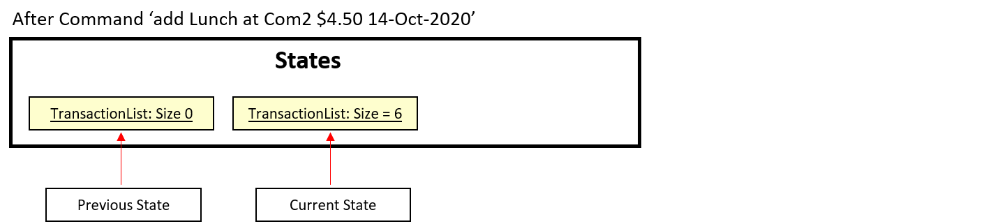

Step 3. User executes ```delete 3``` command to delete the 3rd transaction in the Expenses Tracking Application. TransactionList will be left with 5 records after User delete successfully.

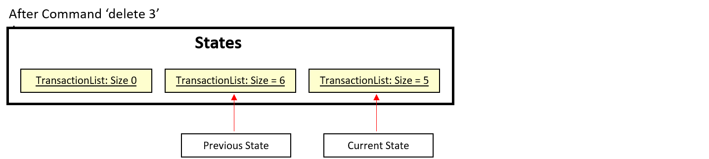


##### Report Feature

The purpose of report feature is to facilitate user to be able to generate a summary report with all the expense details user entered. 
It extends Command and TransactionList, get all the transactions and generate report with a time period.

Given below is an example usage scenario and how the report mechanism behaves at each step.

Step 1. The user launches the application for the first time. The TransactionList is empty.


Step 2. User executes ```add Lunch at ...``` to add a new transaction. The ```add``` command will save the record into TransactionList.


Step 3. After user enters multiple records in TransactionList, they will executes ```report /sd...``` command to generate the report with or without a time period.

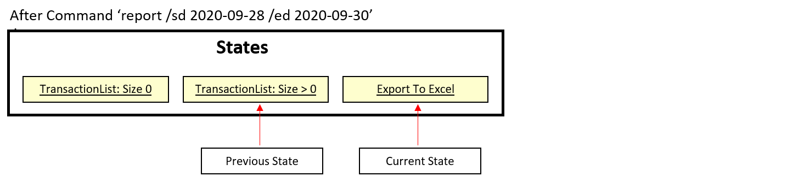

In step 3, the application used an external library named **'Apache-POI'**. This library helps to generate the summary report into an Excel file with the following format:

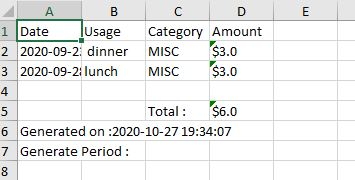

The following activity diagram summarizes what happens when a user executes report command:


## Appendix: Requirements
### Product scope
##### Target user profile

* Has a need to manage his/her expenses
* Is able to use command line interface (CLI)
* Can type fast
* Prefers typing to interaction with a graphical user interface (GUI)
* Is comfortable using CLI apps

##### Value proposition: 
To manage all expenses faster than a typical excel budget spreadsheet.

### User Stories
###### *Priorities: High (must have) - `* * *`, Medium (nice to have) - `* *`, Low (unlikely to have) - `*`*

|Priority|Version| As a ... | I want to ... | So that I can ...|
|--------|--------|----------|---------------|------------------|
|`* * *`|v1.0|Student|see usage instructions|refer to them when I forget how to use the application|
|`* * *`|v1.0|Student|exit the program|close the program|
|`* * *`|v1.0|Student|add my daily expenses in the system|add the information into the system and keep track of my daily expenses|
|`* * *`|v1.0|Student|view all my transactions by category in the system|be aware of what I have added|
|`* * *`|v1.0|Student|remove my daily expense in the system|remove the transactions|
|`* * *`|v1.0|Student|search for an expenses with keyword in the system|filter out the expenses that I want to see|
|`* * *`|v1.0|Student|see the total expense incurred in the system|be aware of my spending|
|`* * *`|v2.0|Student|update my expenses in the system|update the transactions|
|`* * *`|v2.0|Student|Save all transactions to a readable text file and load from it|I can have a copy of transaction history.|
|`* *`|v2.0|Student|categorize my daily expense in the system|better managed/view my expenses|
|`* *`|v2.0|Student|add a budget in the system||
|`* *`|v2.0|Student|delete a budget in the system||
|`* *`|v2.0|Student|view the budget with respect to expenses in the system||
|`* *`|v2.0|Student|view the transactions in the system with a specific time period|I can find the specific transaction more easily|
|`* *`|v2.0|Student|generate and export a transactions report summary with a specific time period|keep a copy and view them outside the system|
|`*`|v2.0|Student|make sure I input daily expenses|I can keep track of it|
|`*`|v2.0|Student|view tips on saving money|have motivation to achieve my goal|

:point_right: View [User Stories on our Trello Board](https://trello.com/b/2290RLsD/nusexpenseshelper "User Stories on Trello~")

### Use Cases

###### (For all use cases below, the System is the `NUS Expenses Tracker` and the Actor is the `NUS Student`)

###### Use Case Diagram
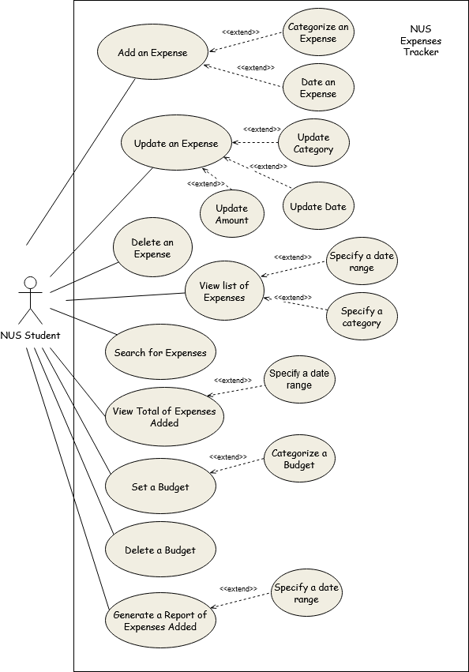

### Non Functional Requirements

1. Should work on any mainstream OS as long it has Java ```11``` or above installed.
2. User will be able to interact with the systems with regular english text. For example: (```
add chicken rice $4.00 2020-11-01 /C FOOD. ```).
3. Will be able to handle up to 1000 expenses without noticeable slowness in performance for typical usage.
4. User will be able to interact with their expenses.txt if they wish to make amendment. 

### Glossary

- *MainStream OS* - Windows, Linux, Unix, OS-X
- NET - NUS Expenses Tracker
- Regex - Regular Expressions
- JDK - Java Development Kit - [Java SE](https://www.oracle.com/sg/java/technologies/javase-downloads.html "Java SE Downloads")
- Gradle - Gradle Build Tool - [Gradle User Manual](https://docs.gradle.org/current/userguide/userguide.html "Build Automation Tool - Docs")
- Intellij / IDE - Intellij Integrated Development Environment - [IntelliJ IDEA](https://www.jetbrains.com/idea/ "JVM IDE") 
- Plugin - IDE Plugins - [Intellij IDEA Plugins](https://www.jetbrains.com/help/idea/managing-plugins.html "Manage plugins")